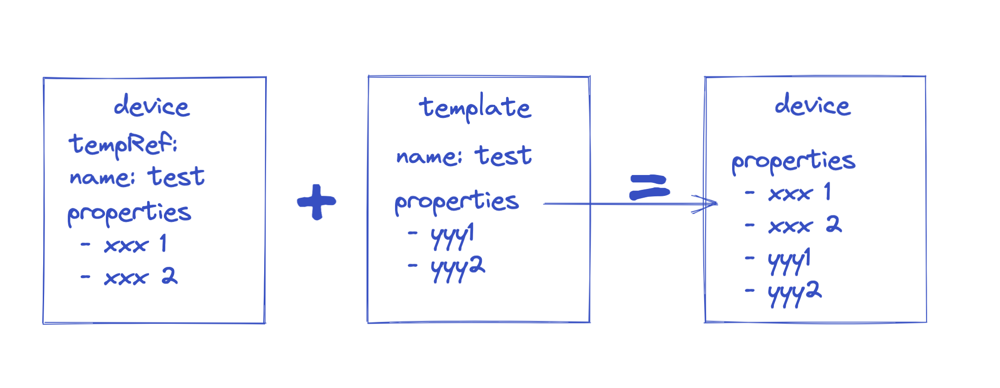
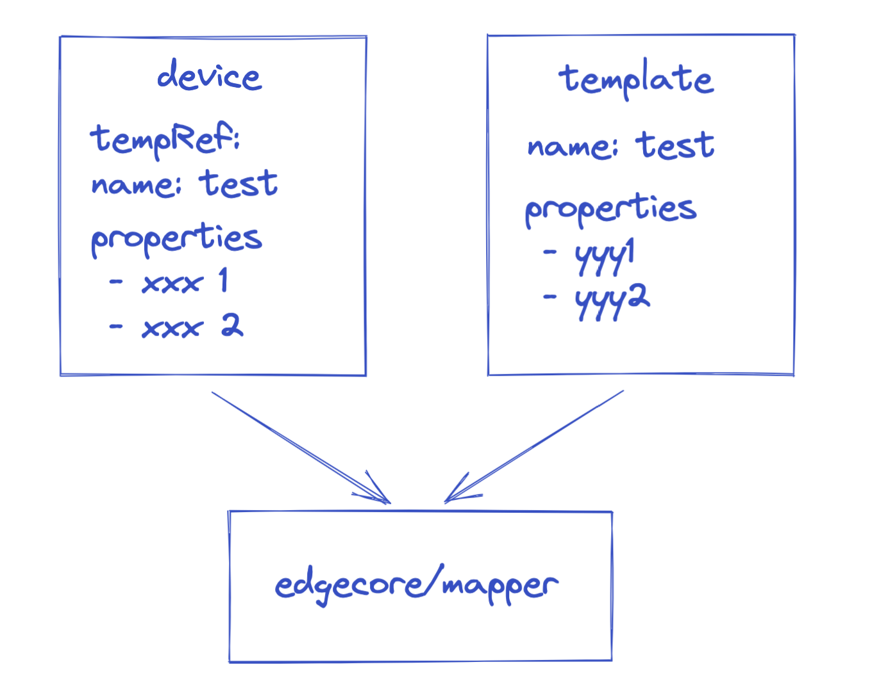
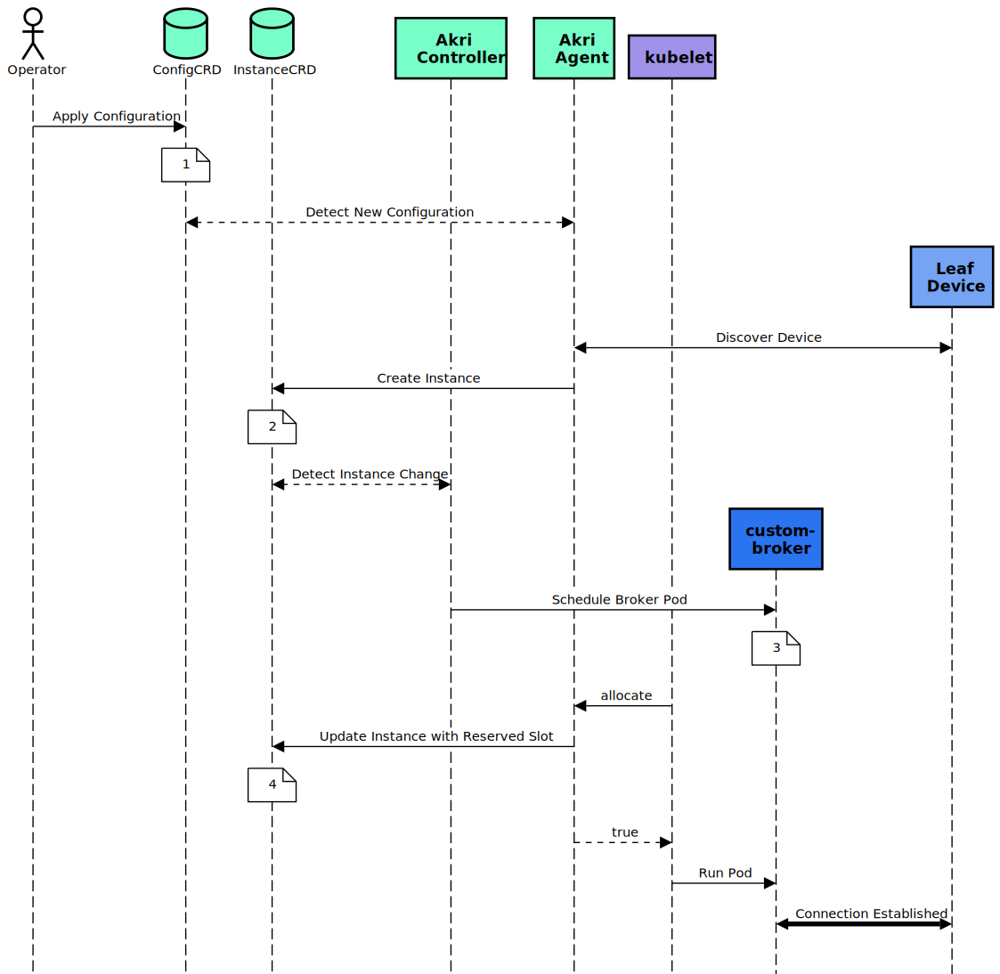

# 设备实例批量方案讨论

## 设备批量 - template

### 生成
在设备实例创建时，套用template，快速生成一个设备yaml

* 优点：一次性使用，对后续使用无入侵
* 缺点：template修改不影响设备实例，但无法同步template修改

### 引用
设备yaml增加字段，声明引用了template，后续处理时套用template的内容

* 优点：template修改可以同步给所有设备实例
* 缺点：如果大量的设备引用了同一个template，同步修改可能压力较大

## 设备批量 - 自动发现

参考：[Akri](https://github.com/project-akri/akri)

### 设备自动发现配置
告诉自动发现Handler，如何找到设备；一旦找到了设备，则通知edgecore，由edgecore上报到云端，创建一个设备实例

### 设备自动创建
Kubeedge收到Handler上报的设备信息，自动创建一个设备实例到K8s中；

需要考虑创建之后，是否还需要下发过程，下发/不下发哪些东西；

